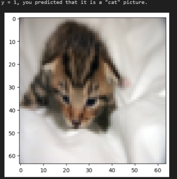
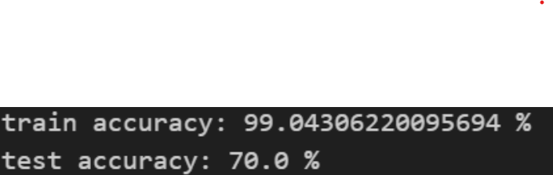
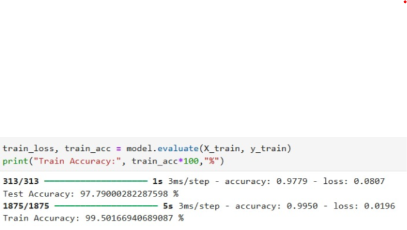
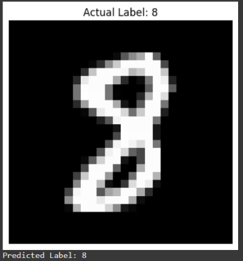
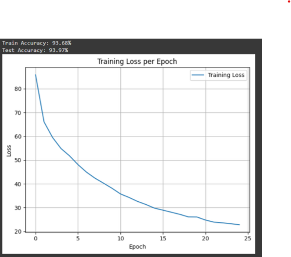

# Mini Project

Before developing the EEG Analyser, we built three **proof-of-concept (PoC)** mini-projects to strengthen our understanding of machine learning fundamentals and neural network implementation.  
Each project focused on a specific type of data and learning objective.

---

## 1. Cat Classifier using Logistic Regression

**Approach:**  
Developed a binary classifier using **logistic regression** to predict whether an input image contains a cat.

**Learning Outcomes:**

- Understood basic mathematical operations behind logistic regression.
- Practiced manual implementation of **forward and backward propagation**.
- Learned the role of **sigmoid activation** and **loss functions** in binary classification.
  

---

## 2. Number Classification (MNIST)

**Approach:**  
Built a **neural network with three hidden layers** for classifying handwritten digits from the MNIST dataset.  
Implemented using **Keras** and **PyTorch**, to explore both frameworks.

**Learning Outcomes:**

- Applied **Softmax** activation for multi-class classification.
- Observed how **hyperparameter tuning** influences model performance.
- Gained hands-on experience with **PyTorch tensors**, **modules**, and **training loops**.
  
  

---

## 3. Mushroom Classification (Edible or Not)

**Approach:**  
Constructed a neural network with **three hidden layers** to classify mushrooms as **edible or poisonous** using tabular data from a CSV file.

**Learning Outcomes:**

- Performed **data preprocessing** for tabular datasets using PyTorch.
- Learned techniques for handling **categorical and numerical features**.
- Strengthened understanding of **PyTorch tensors**, **training loops**, and **model optimization** for structured data.
  
