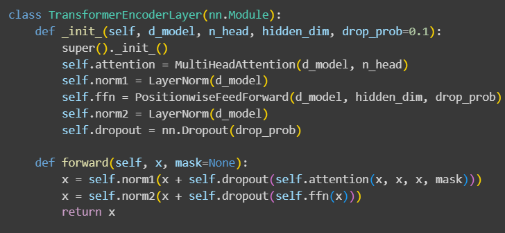
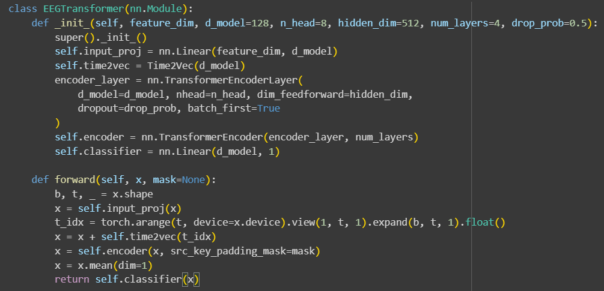
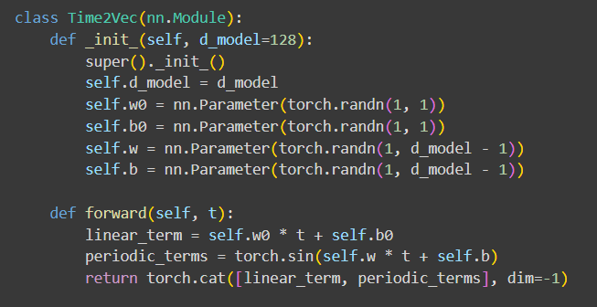
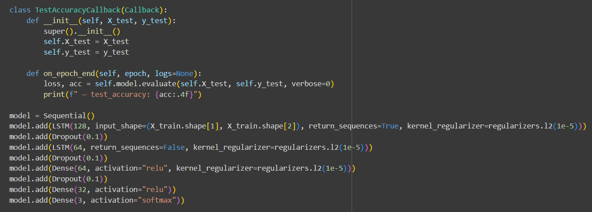
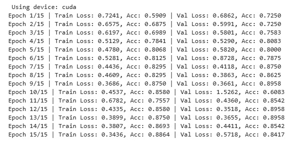
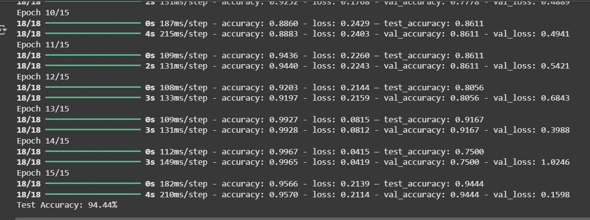
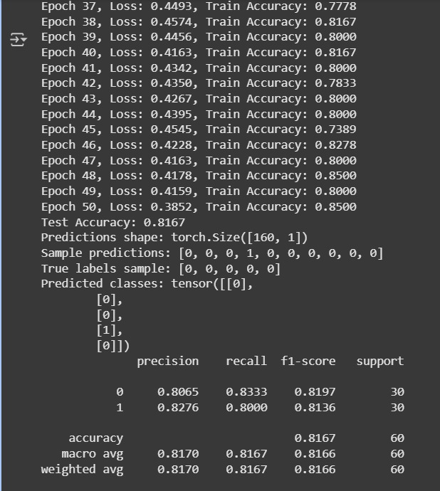
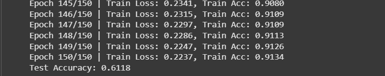

# Model Architecture & Accuracy

This section describes the deep learning architectures implemented for EEG signal analysis and classification.  
The models are divided into two categories based on their application domain:

- **Clinical Models:** Designed for seizure prediction and surgery outcome detection.
- **Behavioral Models:** Developed for classifying stress, emotion, and dream-related emotional states.

## Transformers and LSTMs

EEG signals are inherently temporal and dynamic, meaning that patterns unfold over time rather than appearing instantaneously.
To capture these complex dependencies, our project employs two deep learning architectures — Transformers and LSTMs — each optimized for different EEG contexts.

- Transformer models excel at modeling long-range dependencies using self-attention, making them suitable for clinical tasks where subtle temporal cues (like seizure onset or post-surgery recovery) are crucial.

# Time2Vec

Time2Vec is a time encoding mechanism that transforms time-related features into a higher-dimensional space, capturing both linear and periodic patterns. It uses a combination of sine and linear components to effectively represent temporal information. This encoding helps improve the performance of models in time series forecasting tasks by providing a richer representation of time.

- LSTM networks, are designed for behavioral EEG analysis, effectively learning emotional or cognitive patterns that evolve over shorter sequences.

  

---

## Clinical Models

**Seizure Detection**

- Dataset: Temple University Hospital EEG Epilepsy Corpus (TUEP)

- Objective: Identify seizure onset and assist clinicians in real-time seizure monitoring.

- Architecture: Transformer model with self-attention layers capturing temporal dependencies in EEG.

- Attention highlights periods of high seizure likelihood, enabling early detection and interpretability.

Demonstrates the effectiveness of Transformer-based temporal modeling for EEG seizure analysis.

<!-- Optional Image Placeholder -->

**Epileptic Surgery Outcome Prediction**

- Dataset: HUP iEEG dataset (190 treatment-resistant epilepsy patients)

- Objective: Predict surgery success likelihood to support clinical decision-making.

- Architecture: Transformer combining EEG and clinical features.

- Attention layers highlight key temporal and clinical cues associated with post-surgical outcomes.

Reduces manual evaluation time and shows promise for multimodal EEG-clinical integration.

## Behavioral Models

**Emotion Classification**

- Dataset: SEED Emotion EEG Dataset

- Objective: Classify emotional states (positive, neutral, negative) while subjects watch emotional film clips.

- Architecture: LSTM → Dense → Softmax

- LSTM captures temporal EEG patterns associated with emotions.

- Accuracy: 94.44%

Validates the potential of LSTMs in emotion recognition using EEG time sequences.

**Cognitive Stress Classification**

- Dataset: SAM40 EEG Stress Dataset

- Objective: Classify high vs. low stress levels to support mental health monitoring.

- Architecture: Transformer Encoder + Classifier

- Attention layers focus on bandpower shifts (↑ Beta, ↓ Alpha) linked to stress responses.

- Accuracy: 81.67%

Demonstrates Transformer’s ability to detect subtle cognitive stress patterns in EEG signals.

**Dream Emotion Classification**

- Dataset: DEED Dream EEG Dataset
- Objective: Classify dream emotional valence (positive or negative) from REM-stage EEG.
- Architecture: LSTM captures temporal dependencies → Dense + Softmax for emotion probabilities.

Automates dream emotion analysis and aids research on sleep-related emotional processing.

